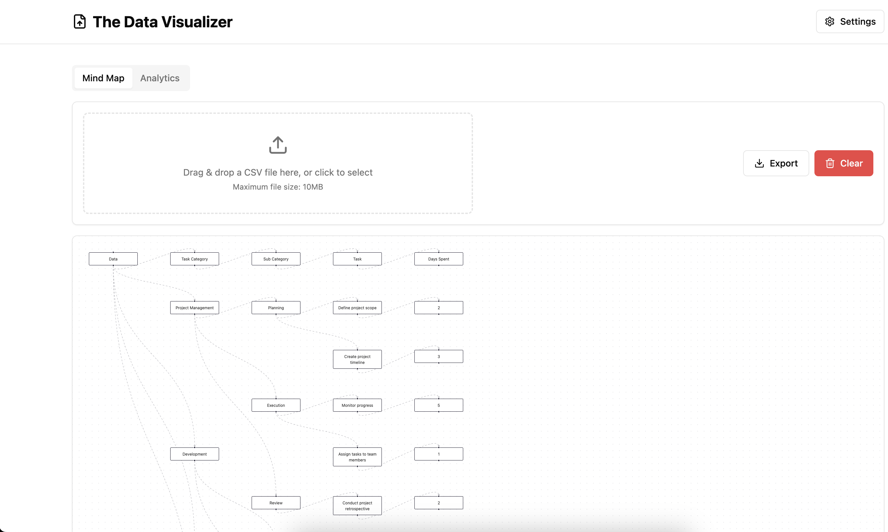
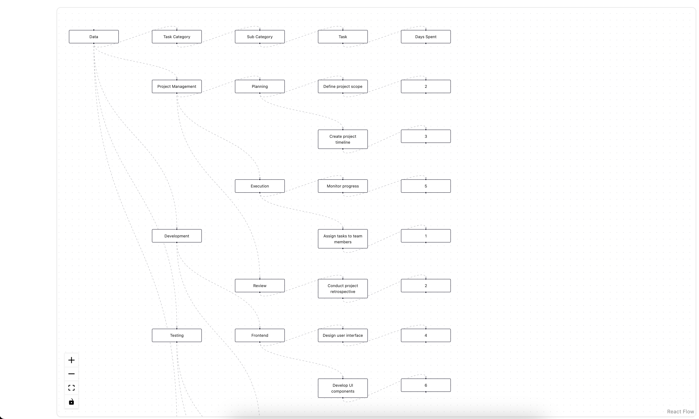
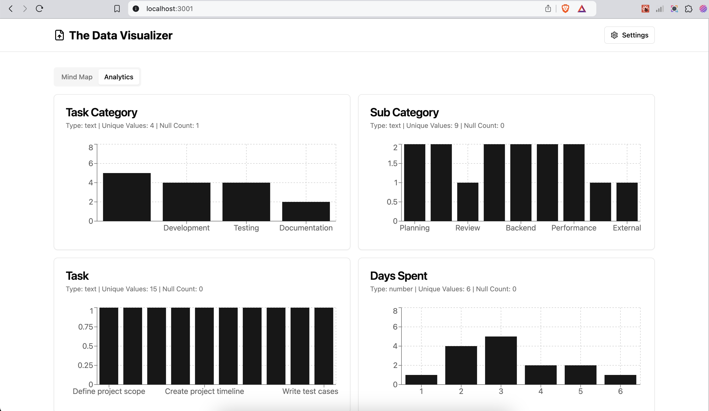

# The Data Tree: Visualize CSV Data with Mind Maps & Bar Graphs

**Transform CSV data into stunning interactive mind maps and bar graphs with The Data Tree. Easily visualize hierarchies, trends, and metrics through zoomable visuals. Featuring CSV validation, rich node details, and seamless exploration, it’s perfect for analysts, educators, and professionals.**

This project is built using **Next.js** and **TypeScript**, providing a robust and scalable foundation for data visualization.

## Key Features

*   **CSV Data Import:** Effortlessly upload and parse CSV files.
*   **Data Validation:**  Ensures your CSV data is in the correct format before processing, preventing errors.
*   **Interactive Mind Maps:**  Visualize hierarchical data structures with zoomable and pannable mind maps.
*   **Dynamic Bar Graphs:** Generate insightful bar charts to represent categorical data and comparisons.
*   **Rich Node Details:** Explore individual data points within the visualizations with detailed tooltips and info panels.
*   **User-Friendly Interface:** Intuitive design ensures a smooth user experience for all skill levels.
*   **TypeScript & Next.js:** Built with modern web technologies for performance and maintainability.

#



#




#

#
## Getting Started

Follow these steps to get The Data Tree up and running on your local machine:

### Prerequisites

*   **Node.js** (version 18 or higher) and **npm** (or **yarn**) installed on your system. You can download Node.js from [nodejs.org](https://nodejs.org/).
*   Basic understanding of using the command line.

### Installation Steps

1.  **Clone the repository:**
    ```bash
    git clone https://github.com/bharathi355/the-data-tree.git
    cd the-data-tree
    ```

2.  **Install dependencies:**
    Using npm:
    ```bash
    npm install
    ```
    Or using yarn:
    ```bash
    yarn install
    ```

3.  **Start the development server:**
    Using npm:
    ```bash
    npm run dev
    ```
    Or using yarn:
    ```bash
    yarn dev
    ```

4.  **Open in your browser:**
    Navigate to `http://localhost:3000` in your web browser to access the application.

## Build for Production

To create an optimized production build, run the following command:

```bash
npm run build
```

This will generate a build folder, ready for deployment.
#
Sample CSV Data
```
Task Category,Sub Category,Task,Days Spent
Project Management,Planning,Define project scope,2
Project Management,Execution,Monitor progress,5
Project Management,Review,Conduct project retrospective,2
Development,Frontend,Design user interface,4
Project Management,Planning,Create project timeline,3
Project Management,Execution,Assign tasks to team members,1
Development,Frontend,Develop UI components,6
Development,Backend,Set up database schema,3
Development,Backend,Implement APIs,5
Testing,Functional,Write test cases,2
Testing,Functional,Perform functional testing,3
Testing,Performance,Conduct load testing,4
Testing,Performance,Optimize application performance,3
Documentation,Internal,Write technical documentation,2
Documentation,External,Prepare user guides,3
```


## Contributing

We welcome contributions to The Data Tree project! Feel free to submit pull requests with improvements, bug fixes, or new features.


